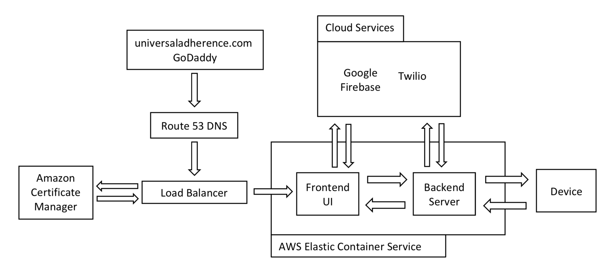

# NIH_Project

### Current Build  [](https://circleci.com/gh/BenFields724/NIH_Project/tree/master)
#### [https://www.universaladherence.com](https://www.universaladherence.com)
## Software Architecture

#### Figure 1: Visual diagram of software architecture elements and communications.

## System Summary
  The software system depicted in Figure 1 is aimed at providing an online application for patients and doctors to track real-time adherence of eye medication. The system is viewable on standard desktops as well as mobile devices. The application is composed of four primary modules (i.e., Main Panel, Data Panel, Calendar Panel, and Alarm Panel). Through these four interfaces the patients and doctors can view when patients have taken eye medication and also update the device schedule and any text messages the patients will be receiving as reminders.
  
  The client-side content is all developed using the React framework, which is a JavaScript library created by Facebook for the creation of User Interface (UI) elements. In the backend, a Node server is used to communicate with the device and place data into the database. This application leverages Google Firebase for User Authentication and Authorization as well as their Realtime Database services. The software system is being hosted through AWS and leverages many features of AWS such as Route53 for DNS services and Elastic Container Service (ECS) for the deployment of containerized software. 
 
## Build
#### Note: Docker must be installed and running on your system prior to starting the application.

### Commands:
run the following commands to get started with this application on your system
```
git clone https://github.com/BenFields724/NIH_Project.git
cd NIH_Project
docker-compose up
```
The application is composed of two docker containers. The frontend is running on port 3000 and the backend on port 8080.

